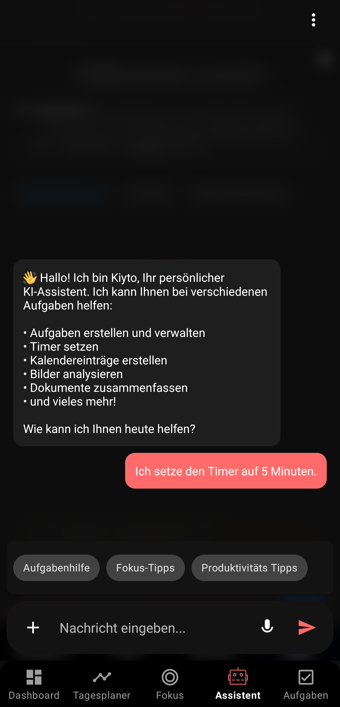
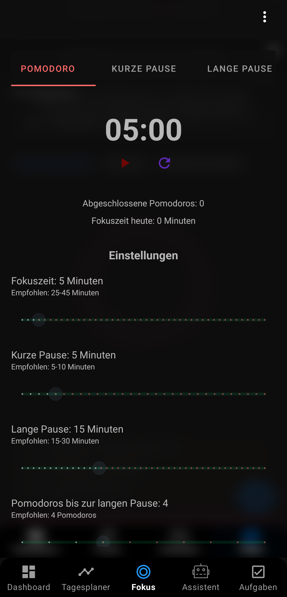
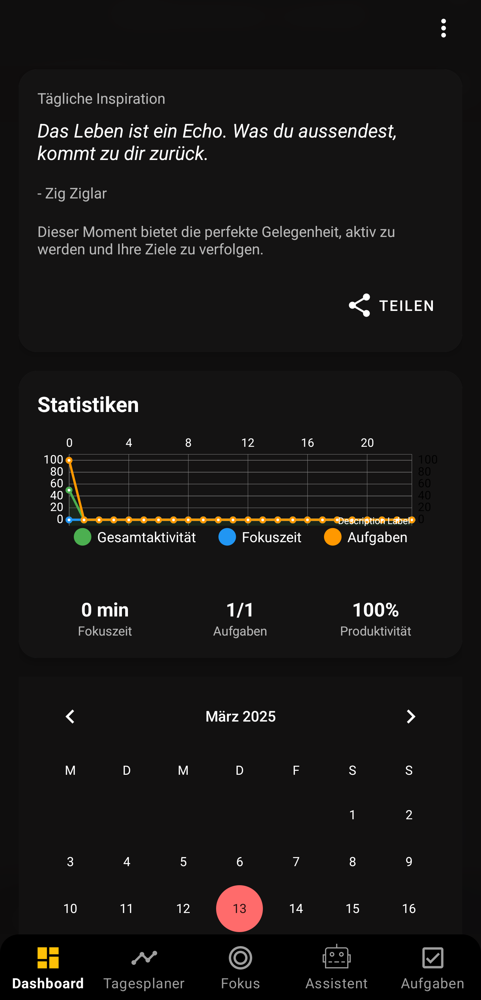

# 🚀 Fokus-Kiyto KI

<div align="center">
  
  <br>
  <h3>Eine KI-gestützte Produktivitäts-App für Android</h3>
</div>

## 📱 Über die App

Fokus-Kiyto KI ist eine moderne Produktivitäts-App, die fortschrittliche KI-Technologien nutzt, um deine Arbeitsweise zu optimieren. Die App kombiniert Aufgabenverwaltung, Zeitmanagement und KI-gestützte Empfehlungen, um dir zu helfen, fokussierter und produktiver zu arbeiten.

### ✨ Hauptfunktionen

- **📋 Intelligente Aufgabenverwaltung**: Organisiere deine Aufgaben mit Prioritäten, Kategorien und Deadlines
- **⏱️ Pomodoro-Timer**: Verbessere deinen Fokus mit anpassbaren Arbeits- und Pausenzyklen
- **🤖 KI-Empfehlungen**: Erhalte personalisierte Vorschläge zur Optimierung deiner Produktivität
- **📊 Produktivitätsanalyse**: Verfolge deine Fortschritte und identifiziere Verbesserungspotenziale
- **🔔 Intelligente Benachrichtigungen**: Werde zur richtigen Zeit an wichtige Aufgaben erinnert
- **🌙 Dunkelmodus**: Schone deine Augen bei der Arbeit in dunkleren Umgebungen

## 🛠️ Technologien

- **Kotlin**: Moderne, sichere und ausdrucksstarke Programmiersprache für Android
- **MVVM-Architektur**: Saubere Trennung von UI, Geschäftslogik und Daten
- **Jetpack-Komponenten**: LiveData, ViewModel, Room, Navigation
- **Coroutines**: Asynchrone Programmierung für reibungslose Benutzererfahrung
- **Material Design 3**: Moderne und ansprechende Benutzeroberfläche
- **KI-Integration**: Fortschrittliche Algorithmen für personalisierte Empfehlungen

## 📸 Screenshots

<div align="center">
  <table>
    <tr>
      <td></td>
      <td></td>
      <td></td>
    </tr>
  </table>
</div>

## 🚀 Installation

1. Lade die neueste Version der App aus dem [Google Play Store](https://play.google.com/store) herunter
2. Oder kompiliere die App selbst:
   ```bash
   git clone https://github.com/DEIN_USERNAME/Fokus-Kiyto_KI.git
   cd Fokus-Kiyto_KI
   ./gradlew assembleDebug
   ```

## 🧩 Architektur

Die App folgt der MVVM-Architektur (Model-View-ViewModel) und verwendet moderne Android-Entwicklungspraktiken:

```
app/
├── data/           # Datenquellen, Repositories, Datenmodelle
├── di/             # Dependency Injection
├── domain/         # Geschäftslogik, Anwendungsfälle
├── ui/             # Activities, Fragments, ViewModels, Adapter
├── utils/          # Hilfsfunktionen und -klassen
└── KiytoApp.kt     # Anwendungsklasse
```

## 🤝 Mitwirken

Beiträge sind willkommen! Wenn du zur Weiterentwicklung von Fokus-Kiyto KI beitragen möchtest:

1. Forke das Repository
2. Erstelle einen Feature-Branch (`git checkout -b feature/amazing-feature`)
3. Committe deine Änderungen (`git commit -m 'Add some amazing feature'`)
4. Pushe den Branch (`git push origin feature/amazing-feature`)
5. Öffne einen Pull Request

## 📄 Lizenz

Dieses Projekt ist unter der MIT-Lizenz lizenziert - siehe die [LICENSE](LICENSE) Datei für Details.

## 📞 Kontakt

Edgar Cuppari - [cupparikun@gmail.com](mailto:cupparikun@gmail.com)

Projektlink: [https://github.com/DEIN_USERNAME/Fokus-Kiyto_KI](https://github.com/DEIN_USERNAME/Fokus-Kiyto_KI)

---

@Icarus-B4's goal is to have 10 monthly sponsors
goal is to earn $4200 per month I'll be able to quit my job and work on open source full time! 😁🎉🤷‍♂️

Dieses Repository ist nur für Sponsoren verfügbar. Um Zugang zu erhalten:

1. Besuche [github.com/sponsors/Icarus-B4](https://github.com/sponsors/Icarus-B4)
2. Wähle einen Sponsoring-Plan
3. Nach erfolgreicher Anmeldung erhältst du automatisch Zugang zum Repository
<div align="center">
  <sub>Mit ❤️ entwickelt in Berlin</sub>
</div> 
